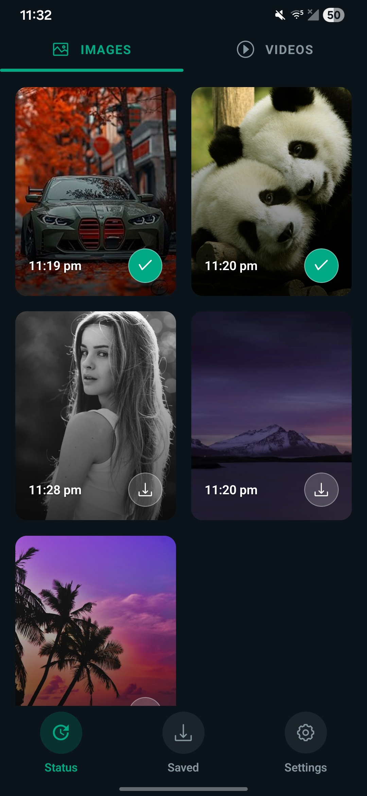
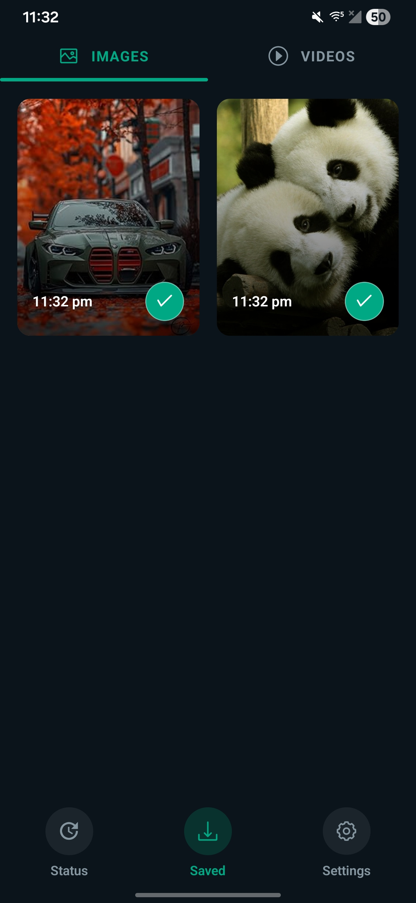
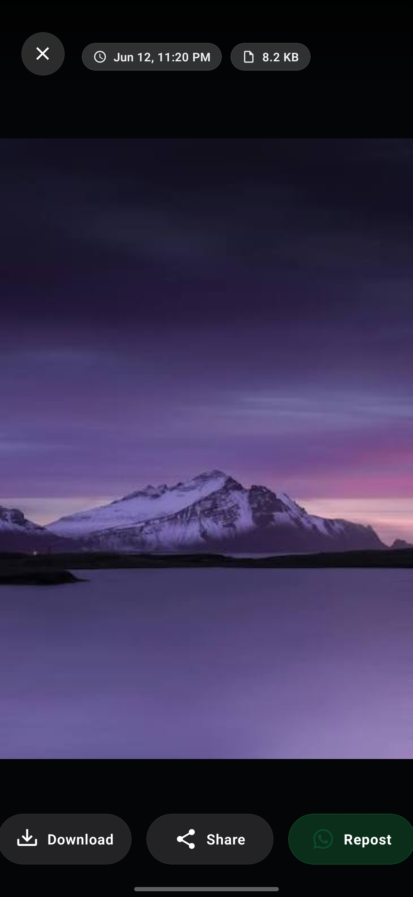
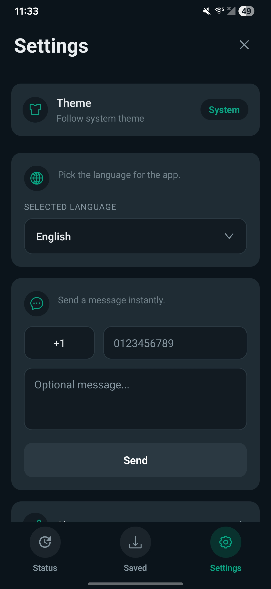

<div align="center">


# LibreStatus

**View, save and share WhatsApp statuses, fully offline.**

No account, no ads, no trackers, no internet permission. Everything happens on your phone.

[](https://f-droid.org/packages/com.vaishnavmandlik.librestatus/)
[](https://github.com/vaishnav-mandlik/LibreStatus/releases/latest)
[](https://github.com/vaishnav-mandlik/LibreStatus/releases)
[](LICENSE)

</div>

---

## Download

<div align="center">

<a href="https://f-droid.org/packages/com.vaishnavmandlik.librestatus/">
  
</a>
<a href="https://github.com/vaishnav-mandlik/LibreStatus/releases/latest">
  
</a>

</div>

- **F-Droid:** [f-droid.org/packages/com.vaishnavmandlik.librestatus](https://f-droid.org/packages/com.vaishnavmandlik.librestatus/)
- **Direct APK:** [LibreStatus-1.0.1.apk](https://github.com/vaishnav-mandlik/LibreStatus/releases/download/1.0.1/LibreStatus-1.0.1.apk) (latest on the [releases page](https://github.com/vaishnav-mandlik/LibreStatus/releases/latest))

> WhatsApp statuses disappear after 24 hours. LibreStatus reads the statuses that
> are already cached on your device after you view them, and lets you keep the ones
> you like.

## Screenshots

<div align="center">

| Statuses | Saved | Full-screen viewer | Settings |
| :---: | :---: | :---: | :---: |
|  |  |  |  |

</div>

## Features

- Browse the image and video statuses currently on your device
- Separate Images and Videos tabs, swipe to switch between them
- Full-screen viewer with video playback and a seek bar
- Save a status to your gallery with one tap
- Share or repost a status to WhatsApp (or any other app)
- A "Saved" tab for everything you've downloaded
- Message a number on WhatsApp without saving it as a contact
- Light, dark, and system themes
- 8 languages: English, Spanish, Portuguese, Russian, French, German, Italian,
  Dutch

## How it works

1. Open WhatsApp and view someone's status.
2. Open LibreStatus.
3. On Android 11 and newer, grant access to the WhatsApp media folder once
   through the system folder picker. On older versions, grant storage access.
4. Tap a status to view it full-screen, then tap download to save it.

The app never uploads anything. The status files it reads are the ones WhatsApp
itself has already stored on your device.

## Privacy

LibreStatus is built to need as little as possible:

- No `INTERNET` permission, so the app cannot send your data anywhere.
- No analytics, no advertising IDs, no crash reporting.
- No `MANAGE_EXTERNAL_STORAGE` ("All files access"). On Android 11+ it uses the
  Storage Access Framework so you choose exactly which folder it can read.

The full privacy policy and terms are available inside the app, under
**Settings → About**.

## Building from source

Requirements: Node 20+, JDK 17, the Android SDK, and an Android device or
emulator.

```sh
# install JS dependencies
npm install

# run on a connected device / emulator (starts Metro automatically)
npm run android

# build a release APK
npm run build:android:release
# output: android/app/build/outputs/apk/release/
```

Run the checks:

```sh
npm test          # unit tests
npm run lint      # eslint
npx tsc --noEmit  # type check
```

## Tech

React Native (0.82, new architecture + Hermes), TypeScript. Status folder access
on Android 11+ is handled by a small native module using the Storage Access
Framework.

## Contributing

Issues and pull requests are welcome. Please keep changes focused and run the
checks above before opening a PR.

## License

[MIT](LICENSE) © Vaishnav Mandlik

## Disclaimer

LibreStatus is an independent, third-party app. It is not affiliated with,
endorsed by, or connected to WhatsApp or Meta. WhatsApp is a trademark of its
respective owner. Please respect other people's privacy and content rights when
saving and sharing statuses.
</content>
</invoke>
